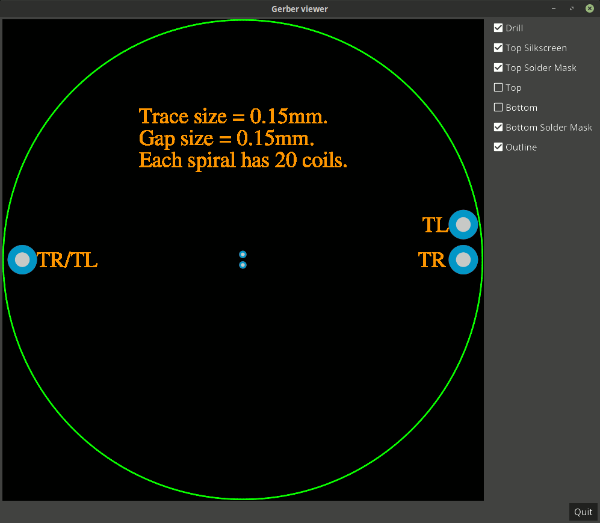

# Bifilar coil

This is a design of a bifilar coil, meaning that when this design is
fabricated on a two-layer printed circuit board (PCB), there will be a
single bifilar coil wired primarily on the top copper layer.

The theory is that when you drive the coil with a sine wave at its
resonant frequency, it can transfer power at its greatest efficiency.

The beauty of this design is that it is parametric.

## How it is wired

Both coils are concentric and wind in the same direction.
Therefore the magnetic field from each coil section combines uniformly
with the other coil resulting in a stronger, cohesive field.

Here is a diagram showing how it is wired:


This shows the various layers on a small (n=20) coil to highlight
the wiring and various layers of the PCB:



## Parametric design

In this design, coils can be created with varying trace widths, gaps
between traces, and number of spirals per coil. As a result, this
parametric design could theoretically be used for coils of any
manufacturable size (from microscopic on up).

## Example coils

In this section, we will document emperically-measured resistances
and resonant frequencies of fabricated coils as they become
available.

### Coil 1

Coil 1 consists of:

```
trace width = 0.15mm (6 mils)
gap width = 0.15mm
number of coils per spiral = 100
```

| From point | To point | DC resistance (Ω) | Resonant Frequency (Hz) |
|   :---:    |  :---:   |      :---:        |         :---:           |
|    TR      |  TR/TL   |       91.2        |                         |
|   TR/TL    |   TL     |       91.2        |                         |
|    TR      |   TL     |      182.2        |                         |

----------------------------------------------------------------------

U.S. Patent pending.

----------------------------------------------------------------------

Enjoy!

----------------------------------------------------------------------

# License

Copyright 2019 Glenn M. Lewis. All Rights Reserved.

Licensed under the Apache License, Version 2.0 (the "License");
you may not use this file except in compliance with the License.
You may obtain a copy of the License at

    http://www.apache.org/licenses/LICENSE-2.0

Unless required by applicable law or agreed to in writing, software
distributed under the License is distributed on an "AS IS" BASIS,
WITHOUT WARRANTIES OR CONDITIONS OF ANY KIND, either express or implied.
See the License for the specific language governing permissions and
limitations under the License.
