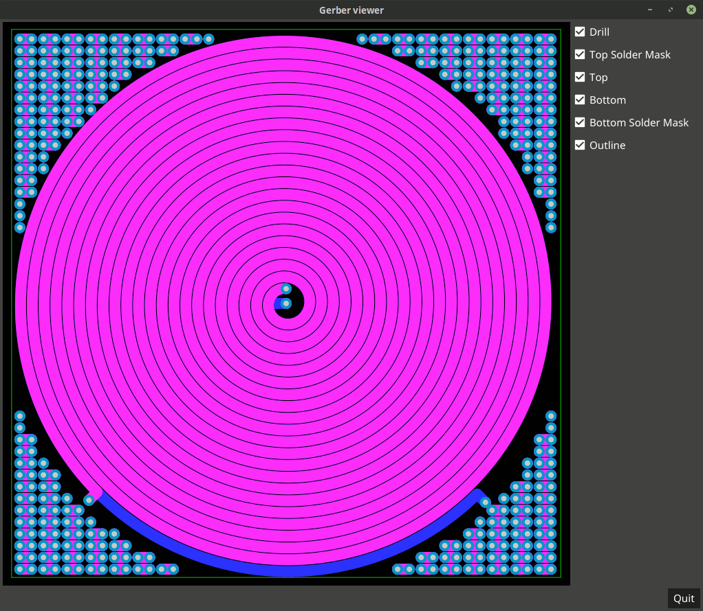

# Single (2-layer) bifilar coil

This is a design of a bifilar coil, meaning that when this design is
fabricated on a two-layer printed circuit board (PCB), there will be a
single bifilar coil.

This designs differs from the others in that a single coil is devoted
to one layer and the board itself is the dielectric between the top and
bottom coils.

This design requires that an external wire connect the inner terminal
of one coil to the outer terminal of the other coil (with the added
benefit of being able to insert a tuning capacitor in between the
two coils.)

The theory is that when you drive the coil with a sine wave at its
resonant frequency, it can transfer power at its greatest efficiency.

The beauty of this design is that it is parametric.

## How it is wired

Both coils are concentric and wind in the same direction.
Therefore the magnetic field from each coil section combines uniformly
with the other coil resulting in a stronger, cohesive field.

Additionally, this design differs in that the two coils are directly
sandwiched together via the board's dielectric such that the capacitance
is stronger between the coils.

Here is a diagram showing how it is wired:

This shows the various layers on a small (n=20) coil to highlight
the wiring and various layers of the PCB:

## Parametric design

In this design, coils can be created with varying board size,
trace widths, and gaps between traces. As a result, this
parametric design could theoretically be used for coils of any
manufacturable size (from microscopic on up).

## Example coils

In this section, we will document emperically-measured resistances
and resonant frequencies of fabricated coils as they become
available.

----------------------------------------------------------------------

Enjoy!

----------------------------------------------------------------------

# License

Copyright 2019 Glenn M. Lewis. All Rights Reserved.

Licensed under the Apache License, Version 2.0 (the "License");
you may not use this file except in compliance with the License.
You may obtain a copy of the License at

    http://www.apache.org/licenses/LICENSE-2.0

Unless required by applicable law or agreed to in writing, software
distributed under the License is distributed on an "AS IS" BASIS,
WITHOUT WARRANTIES OR CONDITIONS OF ANY KIND, either express or implied.
See the License for the specific language governing permissions and
limitations under the License.
