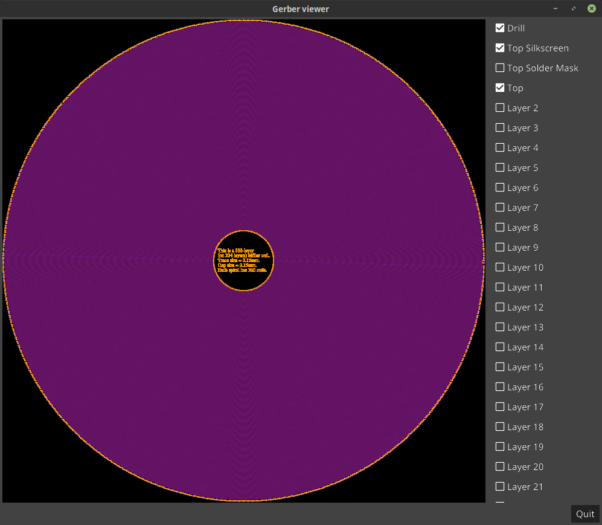

# 333-layer bifilar coil

This is a design of a 333-layer bifilar coil, meaning that if this design
were to be fabricated on a 334-layer printed circuit board (PCB), there would
be 333 bifilar coils wired in series, one bifilar coil per layer. The 334th
layer is required to connect the windings in the proper order. Note that
I'm not aware of any PCB manufacturer anywhere in the world that can handle
fabricating a 334-layer PCB... so the question becomes:

# Why 333 layers?

333 is one of my favorite numbers and reminds me of Jeremiah 33:3.
Also, I figure that if an unusual number of coils can be successfully
wired up like this, it can probably be done for any number of coils.

# Design theory

The theory is that when you drive the coil with a sine wave at its
resonant frequency, it can transfer power at its greatest efficiency.

The beauty of this design is that there are multiple tap points along
the length of the coils that result in different resonant frequencies
due to the varying reactance. Thus, if your electronics drive the
coils properly from the different tap points, this single coil design
can potentially support the optimal energy transfer of multiple
frequencies.

Another experiment to try is to ground the second tap from the end,
drive the end tap with a sine wave at the resonant frequency of the
remainder of the coil, and then get the amplified benefits of the
remainder as in a secondary coil of a transformer.

## How it is wired

All coils are concentric and wind in the same direction.
Therefore the magnetic field from each coil section combines uniformly
with the other coils resulting in a stronger, cohesive field.

Here is a diagram showing how it is wired:

This shows the the top layer on an N=360 coil:

## Parametric design

In this design, coils can be created with varying trace widths, gaps
between traces, and number of spirals per coil. As a result, this
parametric design could theoretically be used for coils of any
manufacturable size (from microscopic on up).

----------------------------------------------------------------------

U.S. Patent pending.

----------------------------------------------------------------------

Enjoy!

----------------------------------------------------------------------

# License

Copyright 2019 Glenn M. Lewis. All Rights Reserved.

Licensed under the Apache License, Version 2.0 (the "License");
you may not use this file except in compliance with the License.
You may obtain a copy of the License at

    http://www.apache.org/licenses/LICENSE-2.0

Unless required by applicable law or agreed to in writing, software
distributed under the License is distributed on an "AS IS" BASIS,
WITHOUT WARRANTIES OR CONDITIONS OF ANY KIND, either express or implied.
See the License for the specific language governing permissions and
limitations under the License.
